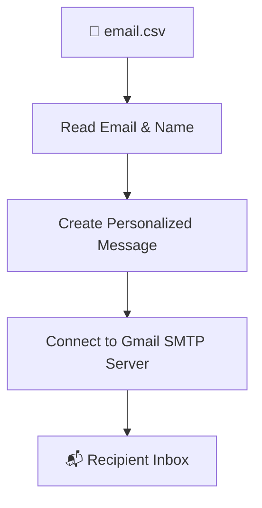

<<<<<<< HEAD
# Email-Automation-Using-Python
=======
<div align="center">
#Email-Automation-Using-Python
  
**A beginner-friendly Python script that sends personalized holiday reminder emails via Gmail SMTP.**

[](https://www.python.org/)
[](https://support.google.com/mail/answer/185833)
[](#-license)
[](#-author)

*Reads recipients from a CSV, personalizes each message, and sends it straight to their inbox — no external libraries required.*

</div>

---

## 📖 Table of Contents

- [Features](#-features)
- [Project Structure](#-project-structure)
- [Requirements](#️-requirements)
- [Gmail App Password](#-gmail-app-password-setup)
- [CSV Format](#-csv-format)
- [Configuration](#️-configuration)
- [Usage](#-usage)
- [How It Works](#-how-it-works)
- [Security Best Practices](#-security-best-practices)
- [Testing Checklist](#-testing-checklist)
- [Responsible Use](#️-responsible-use)
- [Roadmap](#️-roadmap)
- [Author](#-author)

---

## ✨ Features

| | |
|---|---|
| 📄 | Reads recipients straight from a CSV file |
| 👤 | Personalizes each email using the recipient's name |
| 📧 | Sends mail automatically through Gmail SMTP |
| 🔐 | Supports secure Gmail App Password authentication |
| ⚡ | Reuses a single SMTP connection for multiple sends |
| 🖥️ | Runs with one simple command-line call |
| 🐍 | Built entirely with Python's standard library — zero dependencies |

---

## 📁 Project Structure

```
holiday-email/
│
├── 📄 send_email.py     # Main automation script
├── 📄 email.csv          # Recipient list (name + email)
└── 📄 README.md          # You're here
```

---

## 🛠️ Requirements

- **Python 3.x**
- A **Gmail account**
- **2-Step Verification** enabled on that account
- A **Gmail App Password** (see below)

Check your Python version:

```bash
python --version
```

> 📦 **No external packages needed** — this project uses only `csv`, `smtplib`, and `email` from Python's standard library.

---

## 🔐 Gmail App Password Setup

> ⚠️ **Never use your real Gmail password in the script.**

1. Open your [Google Account Security settings](https://myaccount.google.com/security)
2. Enable **2-Step Verification**
3. Go to **App Passwords**
4. Generate a new App Password
5. Copy it — you'll use it in the config step below

⚠️ **Never commit or upload your App Password to GitHub.**

---

## 📄 CSV Format

Create an `email.csv` file with two columns:

```csv
Email,Name
friend1@gmail.com,Shiv
friend2@gmail.com,Harsh
friend3@gmail.com,Achyut
```

| Column | Description |
|--------|-------------|
| `Email` | Recipient's email address |
| `Name`  | Recipient's name (used for personalization) |

---

## ⚙️ Configuration

Open `send_email.py` and set your credentials:

```python
email_user = "YOUR_GMAIL@gmail.com"
password = "YOUR_APP_PASSWORD"
subject = "Holiday Reminder"
```

**Example:**

```python
email_user = "example@gmail.com"
password = "abcdefghijklmnop"
subject = "Holiday Reminder"
```

---

## 🚀 Usage

Clone or download the repo, then run:

```bash
cd holiday-email
python send_email.py
```

**Expected output:**

```
Email sent successfully to Shiv (friend1@gmail.com)
Email sent successfully to Harsh (friend2@gmail.com)
Email sent successfully to Achyut (friend3@gmail.com)

All emails sent successfully!
```

**Sample email:**

> **Subject:** Holiday Reminder
>
> Hello Shiv,
>
> Today you have a holiday, so relax and enjoy it!
>
> Have a great day!

Each recipient gets their own personalized version. 🎁

---

## 🔄 How It Works



---

## 🔒 Security Best Practices

**Never** hardcode credentials:

```python
# ❌ Don't do this
password = "my-real-password"
```

**Instead**, use environment variables:

```python
# ✅ Better approach
import os

email_user = os.getenv("EMAIL_USER")
password = os.getenv("EMAIL_PASSWORD")
```

And keep sensitive files out of version control via `.gitignore`:

```gitignore
.env
email.csv
__pycache__/
```

---

## 🧪 Testing Checklist

Before mailing your full list:

- [ ] Add only your own email to `email.csv`
- [ ] Run the script
- [ ] Confirm the email arrives
- [ ] Check formatting & personalization
- [ ] Add the remaining recipients

---

## ⚠️ Responsible Use

This project is intended **only** for legitimate emails to people who expect to receive them. Please avoid sending unsolicited bulk mail or bypassing Gmail's sending limits.

---

## 🗺️ Roadmap

- [ ] HTML email templates
- [ ] Attachment support
- [ ] `.env` configuration
- [ ] Email delivery logging
- [ ] Error handling & retry mechanism
- [ ] Scheduled sending
- [ ] Multiple email templates
- [ ] Email status report
- [ ] GUI interface
- [ ] Docker support

---

## 👨‍💻 Author

**Dhairya Panchal**
BSc IT — Cloud & Application Development

<div align="center">

### ⭐ If you find this project useful, consider starring the repo!

</div>
>>>>>>> ae23fc541a0a4c7ef0efa2d68b66fd10b8901f46
